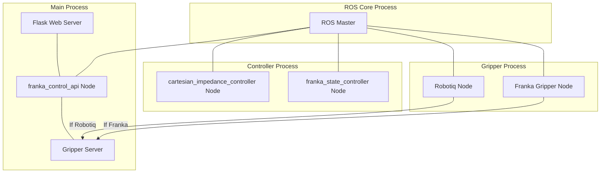
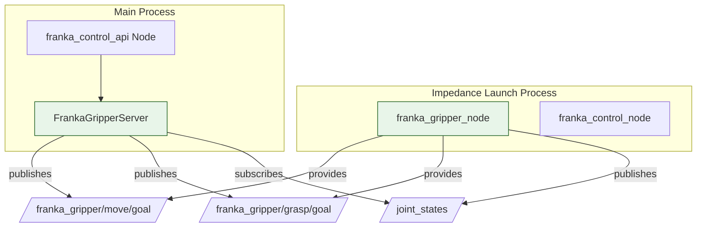
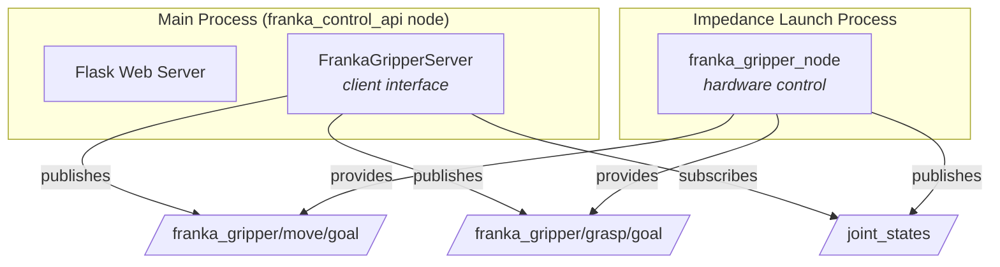
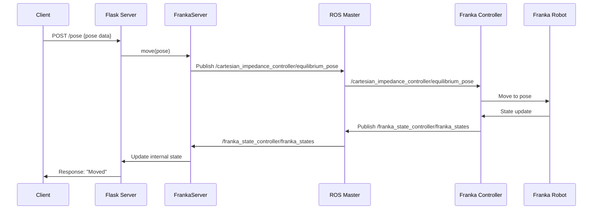
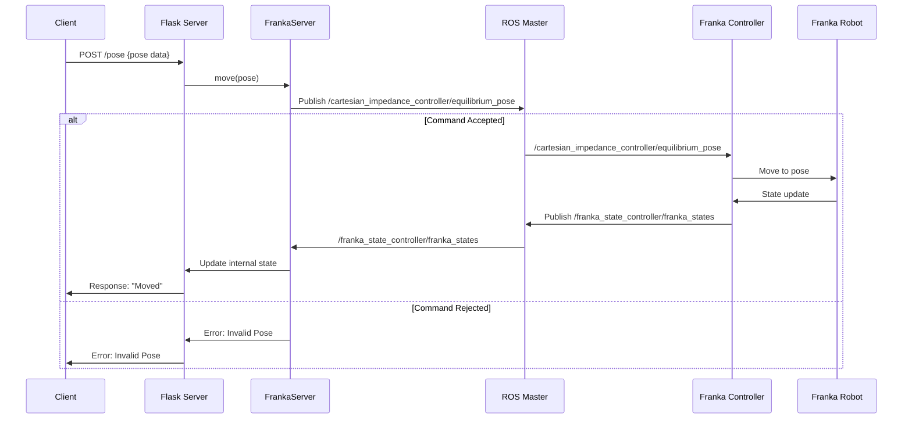

# Franka Server Architecture

## The relationship between gripper server and Franka gripper node

------

## Example: Moving the robot

### Scenario

### Nuances and Considerations

1.  **ROS Services**: While topics are suitable for continuous data streams (like state updates), ROS services might be a better choice for specific, request-response interactions, such as setting robot parameters or triggering one-time actions.

2.  **Actionlib**: For long-running or complex actions (like a complete pick-and-place task), ROS's `actionlib` is often preferred. It provides a standardized way to manage goals, provide feedback, and handle cancellation.

3.  **Direct Communication (Sometimes)**: In some cases, direct communication between nodes (without going through the ROS Master for every message) can be more efficient. However, this requires more complex setup and is less common for basic control tasks.

4.  **Error Handling**: The diagram doesn't explicitly show error handling. In a real-world system, it's crucial to include mechanisms for detecting and responding to errors at each stage of the process.

5.  **Security**: Depending on the application, security considerations (authentication, authorization, encryption) might be necessary, especially if the ROS network is exposed to external systems.

### Improved Diagram (Illustrative)

